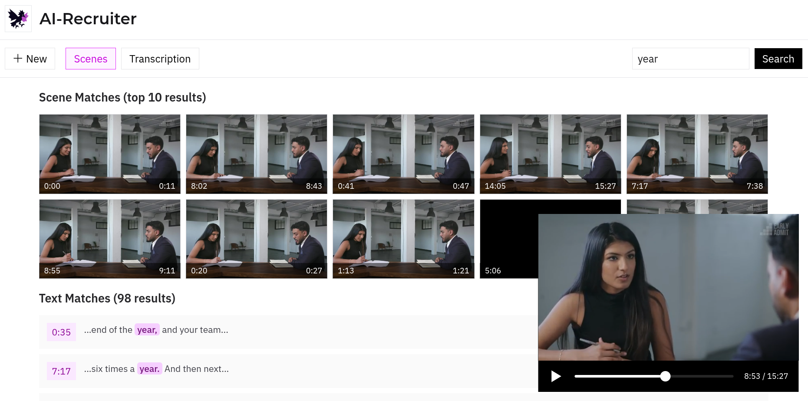

<p align="center">
  
</p>


<p align="center">
  <a href="https://recruiter.zapdoslabs.com/" target="_blank"><strong>recruiter.zapdoslabs.com</strong></a>
</p>
<p align="center">Upload and analyze interview videos with Zapdos API</p>

# Overview

AI Recruiter is a web app for uploading and analyzing videos using the Zapdos API. It features scene and transcription analysis.

## Grabbing a Zapdos API Key

1. Go to the [Zapdos dashboard](https://app.zapdoslabs.com/) and sign in.
2. Create a new API key.
3. Add it to your `.env` file in the project root:

   ```env
   ZAPDOS_API_KEY=your-key-here
   ```

## Developing

1. Install dependencies:
   ```bash
   bun install
   ```
2. Start the development server:
   ```bash
   bun run dev
   ```
3. Open the app in your browser at `http://localhost:3000`.
4. Upload a video to try the AI recruiter features.
